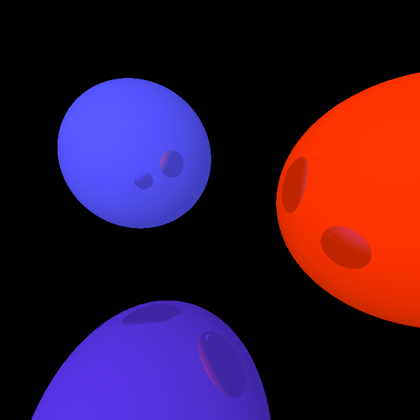

# Luksja Raytracer

Very simple raytracer with OpenGL 3 interactive preview made as university project

Object view:

# Movement

  - [r] render
  - [tab] switch between object and render mode
  - [w,s,a,d] move camera in object mode
  - [right mouse button] move camera around, change objects properties
  - [mouse wheel] zoom

# Dependencies

  - gldinding https://github.com/cginternals/glbinding#compile-instructions (checkout to `96dbfd46d67960d2e52aa9d472da99aab9f6f5a3`)
  - sdl2
  - assimp
  - nlohmann/json
  - imgui
  - glm
  - stb image

# Others
This renderer allows to change objects and camera parameters during rendering, which makes it cool tool for creating intentionaly glitched images.

# Afterwords

Raytracers are awesome.
Even raytracer as simple as this one can render objects of beauty:

